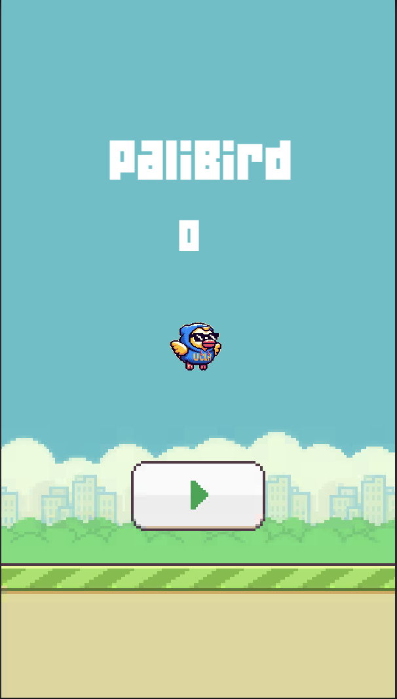
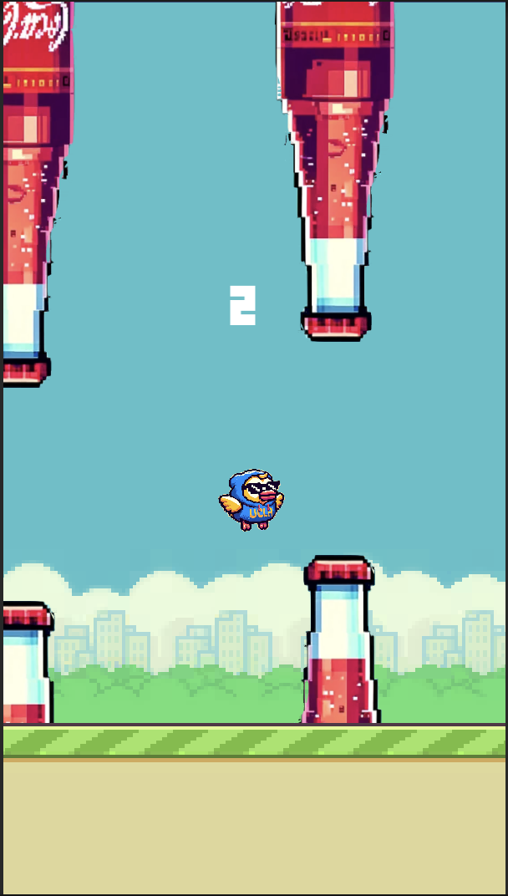

# PaliBird (Flappy Bird with a personal twist)

## Inspiration

Coding my version of Flappy Bird, dubbed PaliBird, was the most fun project I've ever undertaken. Inspired by a friend's nostalgia for the game, I took on the challenge of recreating it using Unity and C#.  

## Process

I transformed the iconic bird into my avatar and swapped the green pipes for coke bottles, reflecting my love for Coca-Cola. Adding a retro remix of my favorite song gave it a unique twist. The process of overcoming the initial hurdles in learning Unity and finally playing the game on my phone was immensely satisfying. 

## Technologies

Unity, C#, Adobe Photoshop

## Screenshots

<table>
  <tr>
    <td></td>
    <td></td>
  </tr>
</table>

### Email me at siddhantpaliwal@g.ucla.edu to get TestFlight link!